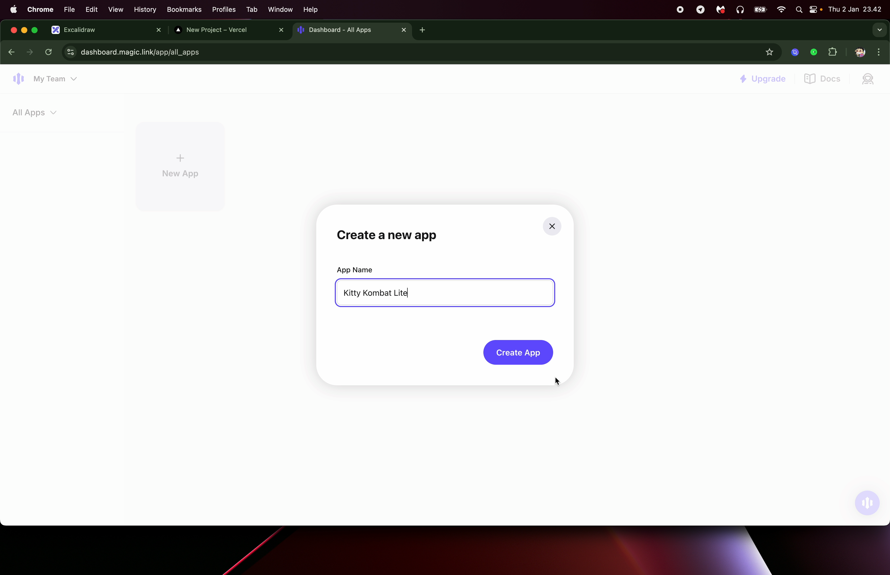

# Kitty Kombat Lite

View live demo on Telegram: <a href="https://t.me/KittyKombatLiteBot/app/" target="_blank">https://t.me/KittyKombatLiteBot/app/</a>

Deploy your own onchain Telegram game powered by Flow blockchain: [1-Click Starter](https://dapp-deployer.vercel.app/)


---

# Production Setup Guide

## Follow Video Tutorial

You can follow this video walkthrough on how to setup your onchain Telegram game

<iframe width="560" height="315" src="https://www.youtube.com/embed/w70ICeVh6fY?si=Ep-qjNTq6APcQZQP" title="YouTube video player" frameborder="0" allow="accelerometer; autoplay; clipboard-write; encrypted-media; gyroscope; picture-in-picture; web-share" referrerpolicy="strict-origin-when-cross-origin" allowfullscreen></iframe>

## Prerequisites

1. Create accounts and gather credentials:
    - <a href="https://vercel.com" target="_blank">Vercel</a> account for deployment
    - <a href="https://magic.link" target="_blank">Magic.link</a> account for custodial wallets

## Frontend Deployment on Vercel

1. Visit <a href="https://vercel.com" target="_blank">[Vercel](https://vercel.com)</a> and sign in

2. Add a new project and import your repo


3. Before you click deploy, choose `build and output settings` and add the following custom `install command`

```sh
npm install --legacy-peer-deps
```


4. Click on the Deploy button and save your domain URL


## Magic Link Setup

1. Visit <a href="https://magic.link" target="_blank">https://magic.link</a> and sign in

2. Create a `new app` and enable `email` and `sms` login




3. Go to `Settings` and `Add Domain` from your Vercel deployment to `Allowed Origins & Redirects` and press `Save`


4. Save your publishable api key and add it to your Vercel `Environment Variables` under your Vercel project's `Settings`. Remember to press `Save`

```
NEXT_PUBLIC_MAGIC_API_KEY
```


5. Redeploy your latest build to make sure the magic api key environment variable gets added to your app.


## Telegram Web App Setup

1. Go to [BotFather on Telegram](https://t.me/BotFather), the official bot for managing Telegram bots and web apps.

2. Create a Telegram Bot

Use the command 

```
/newbot
```

3. Create a Telegram App

Use the command 

```
/newapp
```

4. Configure Menu Button

Use the command `/mybots`, choose your Telegram bot to access `Bot Settings` -> `Menu Button` -> `Configure menu button`, type in your domain URL and enter the text to be displayed on your button (E.g. "Play")

5. Configure Mini App

Go to `Bot Settings` -> `Configure Mini App` -> `Enable Mini App` and type in your domain URL.

## Security Notes

-   Your Magic.link publishable key `NEXT_PUBLIC_MAGIC_API_KEY` is safe to commit

-   Add `.env` to your `.gitignore` file if it's not already there

## Environment Setup

1. Create a `.env` file in your project root:

```properties
NEXT_PUBLIC_MAGIC_API_KEY=your_magic_publishable_key
```

## Run locally

1. Install dependencies:

```sh
npm install
```

2. Run the project:

```sh
npm run dev
```
